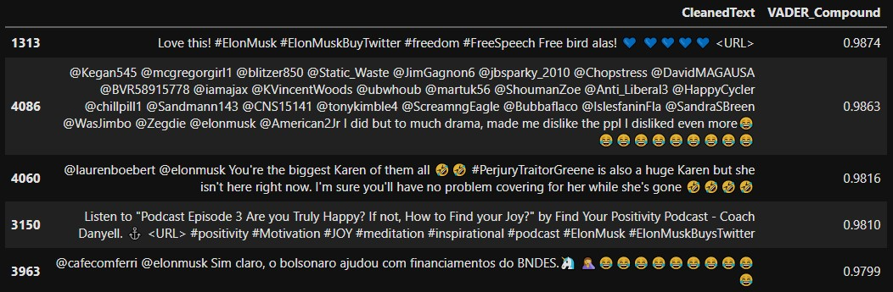
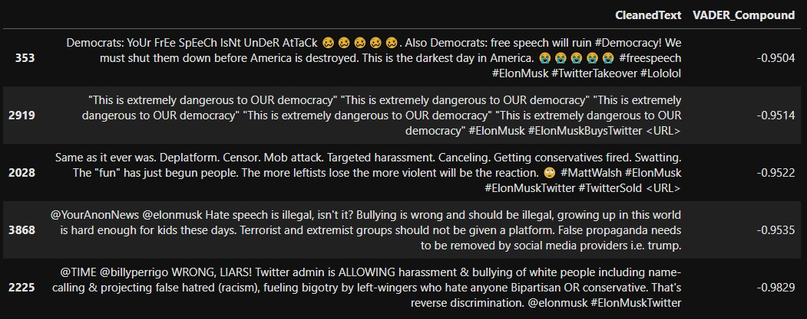
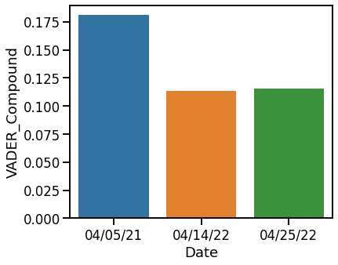
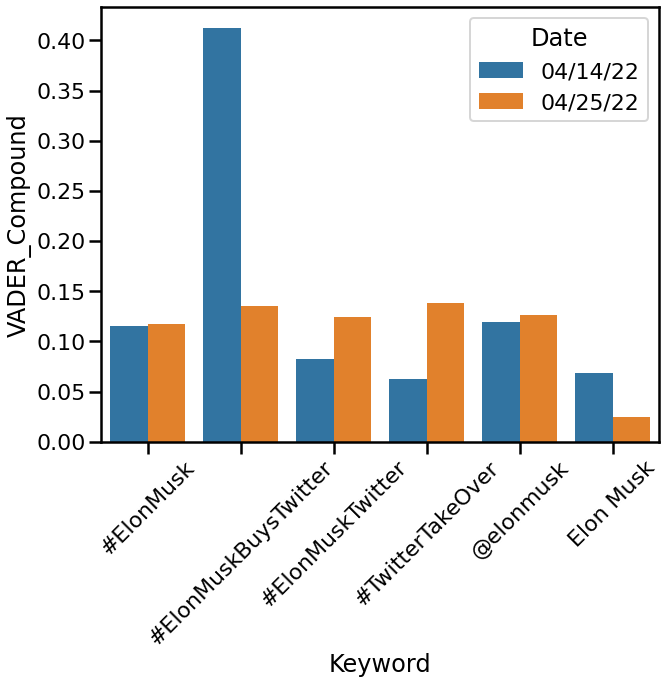

# NLP MVP
## Elon Musk Twitter Buyout Sentiment Analysis
##### Josh Wang
##### May 8 2022

---
### MVP Overview
**Goal**:

Analyzing Twitter Sentiment on Elon Musk's Twitter Buyout

**Process**:

- Three time points were selected:
	2021-04-05, a relatively uneventful time as control
	2022-04-14, when Elon first announced his offer
	2022-04-25, when Twitter accepted Elon's offer
	
- Tweets were scraped from Twitter using snscrape based on keywords about the Twitter buyout. 1000 tweets per keyword.

- Average sentiment from each timepoint was obtained using VADER

**Preliminary Results**:

Figure 1. Top positive tweets when Twitter accepted Elon's offer.

Figure 2. Top negative tweets when Twitter accepted Elon's offer.

Figure 3. Barplot of the average sentiment of the three timepoints.

Figure 4. Barplot of the average sentiment of the later two timepoints by keyword.

**Next Steps**:

- Scrape more tweets.
- Filter out intentionally antagonizing tweets (filterwords=['leftist','libtard','republican','snowflake'...])
- Getting political affiliation of each user by Twitter following
- Topic modeling