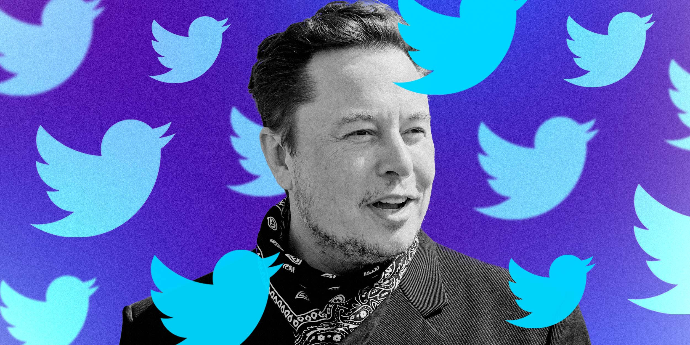

# NLP Project Writeup

## Elon Musk Twitter Deal Sentiment Analysis

Josh Jingtian Wang

5/18/2022

---

__Abstract:__

In the current polarized political climate in the United States, the political alignments of big corporations have become an important business decision. Often, siding with one faction of the society could result in backlash and loss of business from the other.
Besides being the CEO of Tesla and SpaceX, Elon Musk is perhaps the most famous for his flamboyancy and political incorrectness on social media. With his recent takeover of Twitter, the long-deemed left-leaning social media company stand at a business crossroads. 

__Design:__

Now that the fate of Twitter is tied to Elon's public image, tt is crucial to understand the public feedback on Elon Musk’s acquisition of Twitter to minimize loss and maximize opportunities.

__Data Description:__

Ten thousand tweets from twitter users from 4 different time points (4/5/21 as control, 4/14/22 when Elon's offer was announced, 4/25/22 when Elon's offer was accepted, 5/10/22 when Elon announces he would unban Trump) were scraped from Twitter.

__Algorithm:__

- Tweets were scraped.
- Twitter users were arbituarily categorized into conservative and non-conservative based on their profile description.
- Stop words, @mentions, punctuations were removed. Non-English tweets were removed.
- Sentiment analysis by VADER.
- Tweets were lemmatized and vectorized.
- Topic modeling by NMF, LSA and LDA. LSA was chosen.
- Word clouds were generated.

__Tools:__

snscrape, Pandas, spacy, sklearn, gensim, matplotlib, seaborn, wordcloud

__Communication:__

Please refer to the slides ([.ppt](./presentation_josh_wang.pptx)/[.pdf](./presentation_josh_wang.pdf)).

